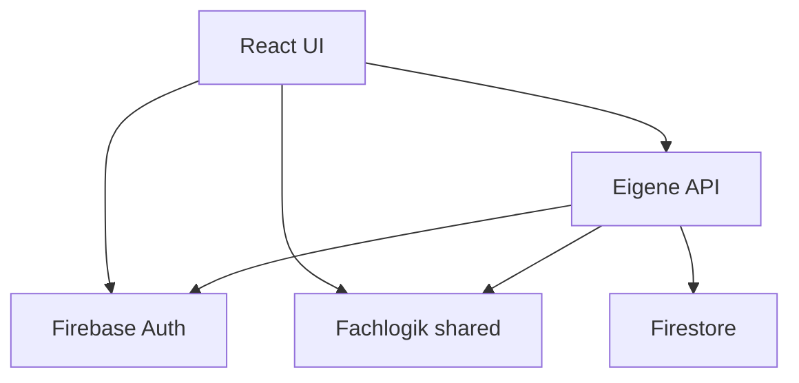
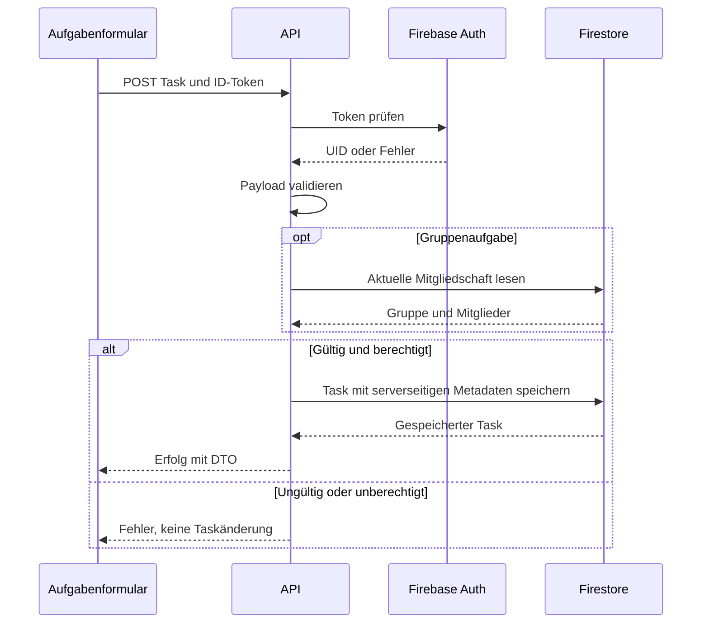

# StudyPrio – Architektur

**Entwurf der Zielarchitektur; noch nicht umgesetzt.** A01–A09 und A12.
Die ADRs sind vorgeschlagen, keine nachträglich erfundenen Teamentscheidungen.

## A01 Einführung und Ziele

Fachliche Ziele: [Spec](../spec/README.md). Technische Ziele: nachvollziehbarer
Score, serverseitige Zugriffsprüfung, reproduzierbarer lokaler Start.
Abnahme: PRIO-Grenzfälle, Nichtmitgliedzugriff, Installation aus frischem Clone.
Eigene Logik liegt in API-Services, Rechteprüfung, Validierung und Priorisierung.

## A02 Randbedingungen

Fünf Mitglieder, M3 am 25.09.2026, angemeldeter JavaScript/React/Firebase-Stack.
Keine Abhängigkeit von bezahltem Cloud-Functions-Deployment für lokale Abnahme.
Das Team muss Emulatorbetrieb und konkretes Hosting praktisch prüfen.

## A03 Kontextabgrenzung

Browsernutzer interagieren mit React. Firebase Auth verwaltet Konten, Firestore
Daten. Gruppenbesitzer verwalten Mitglieder innerhalb StudyPrio.
Keine Kalender-, Moodle- oder E-Mail-Integration.

## A04 Lösungsstrategie

React hält Darstellung und API-Zugriff; eigene Node.js/Express-API übernimmt
Tokenprüfung, Feldvalidierung, Mitgliedschaft und Firestore-Zugriff. Fachregeln
werden aus shared importiert. Kein direkter Firestore-Zugriff des Browsers.
Der Firebase Admin SDK umgeht Firestore-Regeln; daher muss jeder API-Pfad seine
Rechte selbst prüfen. Firestore-Regeln verweigern Clientzugriffe vollständig.

## A05 Bausteinsicht und Verträge

| Use Cases | Geplante Module |
|---|---|
| UC-01 | frontend/src/features/auth; backend/src/middleware/auth.js |
| UC-02/03/06 | frontend/src/features/tasks; backend/src/services/taskService.js |
| UC-04 | frontend/src/features/dashboard; shared/src/calculatePriority.js |
| UC-05 | frontend/src/features/groups; backend/src/services/groupService.js |
| UC-07 | frontend/src/features/comments; backend/src/services/commentService.js |
| Alle Eingaben | shared/src/validation.js; backend/src/routes |

Alle /api-Pfade benötigen Bearer-ID-Token, außer optionaler Healthcheck.
API liefert DTOs mit D2-Namen, Datum als ISO-String mit Zeitzone.
Keine Clientwerte für ownerId, authorId oder Zeitstempel übernehmen.

| Endpoint | Verhalten / Zugriff |
|---|---|
| GET /api/tasks | Eigene persönliche + zugängliche Gruppenaufgaben; serverseitig filtern |
| POST /api/tasks | Gültige D2-Eingaben; groupId erfordert Mitgliedschaft |
| PATCH /api/tasks/:id | Änderbare Felder, persönliche Eigentümerschaft oder aktuelle Mitgliedschaft |
| DELETE /api/tasks/:id | Gleiche Rechte; Task und Kommentare vollständig entfernen |
| GET /api/groups | Nur Gruppen des Nutzers |
| POST /api/groups | Besitzer aus Token; memberIds beginnt mit Besitzer |
| POST /api/groups/:id/members | Nur Besitzer; body.email für bereits registriertes Konto |
| DELETE /api/groups/:id/members/:uid | Nur Besitzer; Besitzer selbst nicht entfernen |
| GET /api/tasks/:id/comments | Nur Gruppenmitglied; chronologisch sortiert |
| POST /api/tasks/:id/comments | Nur Gruppenmitglied; body.body gemäß D2 |

Lookup registrierter Konten nur für authentifizierten Gruppenbesitzer; keine
allgemeine Kontosuche. Erfolgreicher Lookup ergänzt UID atomar zur Gruppe,
ohne Passwort- oder unnötige Kontoinformationen zurückzugeben.

Fehlervertrag: { error: { code, message, fields? } }.
400 ungültig, 401 fehlende/ungültige Anmeldung, 403 fehlende Rechte,
404 nicht vorhanden, 500 interne Störung. UI zeigt verständliche Texte;
Serverantwort enthält keinen Stacktrace. DTO-Verträge vor Umsetzung finalisieren.

## A06 Laufzeitsicht

UC-02/UC-06 und Ablehnung bei fehlenden Rechten:

UC-04: API liefert berechtigte Tasks. Dashboard entfernt erledigte Tasks,
berechnet alle Scores mit demselben now und sortiert nach PRIO-01.
UC-07: Rechte und Taskexistenz innerhalb Transaktion prüfen, dann Kommentar
speichern; verhindert Kommentare für bereits gelöschte Tasks.

## A07 Verteilungssicht

Lokal geplant: Vite-Devserver 5173, API 3001, Auth-Emulator 9099,
Firestore-Emulator 8080. Das sind vorgeschlagene Ports, keine geprüfte Konfiguration.
Vite leitet /api an Backend weiter. Emulatoren benötigen kompatible Java-Version;
Ahshan dokumentiert die tatsächlich getesteten Runtime-Versionen.

Produktiv: statisches Frontend plus Node-API, Firebase Auth/Firestore.
Hosting-Provider noch offen. Nur API erhält Admin-Credentials. Emulatorvariablen
dürfen nicht im Produktionsbetrieb gesetzt sein. INSTALL muss den gewählten
Betriebsmodus und CORS/Origin-Konfiguration erklären.

## A08 Querschnittliche Konzepte

Rechte werden für jede Anfrage neu geprüft; Gruppenentfernung entzieht
Zugriff auch einem ursprünglichen Taskautor. Persönliche Tasks: ownerId=Token-UID.
Gruppentasks: aktuelle UID in memberIds, unabhängig von ownerId.

Gemeinsame Validierung für UI/Server, Server bleibt verbindlich.
Firestore Timestamps intern, ISO-DTOs extern, lokale Formatierung in UI.
Mitglieder atomar ergänzen/entfernen, Besitzer nicht entfernbar.
Tasklöschung nutzt Transaktion mit vorherigem Lesen der Kommentare; Kommentar-
erstellung liest Task und Gruppe in Transaktion. Beide Pfade müssen zusammen
auf Konkurrenzfälle geprüft werden. Keine unbegrenzte atomare Löschung zusichern;
konkrete Firestore-Limits und Strategie vor Implementierung prüfen.

Taskänderung: letzte erfolgreiche Speicherung gewinnt. Keine Offline-Schreibwarteschlange.
Token nicht loggen; Admin-Credentials nur Backend. Fachlogik mit festen Zeitwerten,
API-Rechte im Emulator testen. UI-Fehler erhalten Eingaben statt Scheinerfolg.

## A09 Architekturentscheidungen

- [ADR-001 JavaScript und npm-Workspaces](adr/001-language-workspaces.md)
- [ADR-002 Firebase Auth und Firestore](adr/002-firebase.md)
- [ADR-003 Eigene API und Rechteprüfung](adr/003-api-boundary.md)
- [ADR-004 Separate deterministische Priorisierung](adr/004-priority.md)
- [ADR-005 Emulatoren für lokale Abnahme](adr/005-local-operation.md)

Status jedes ADRs prüfen, bei Änderung Konsequenzen und Code anpassen.
A10/A11 entfallen gemäß Kurs-README und Dozenten-Mail vom 31.08.2026.

## A12 Glossar

API: eigene HTTP-Schnittstelle. DTO: transportierte Datenstruktur.
ADR: begründete Architekturentscheidung. Emulator: lokaler Ersatz eines Dienstes.
Admin SDK: privilegierter Firebase-Serverzugriff. Fachbegriffe siehe Spec E2.

## Eingesetzte KI-Werkzeuge

ChatGPT/Codex am 15.09.2026 für Zielarchitektur, Diagrammquellen und ADR-Entwürfe.
Abgleich gegen Kursvorgaben, Bewertung, TEAMINFO und bereitgestellte Mails.
Noch keine Architektur-Code-Konformität oder laufende Umgebung bestätigt.
Das Team muss Entscheidungen, APIs und Konkurrenzfälle prüfen; Ergebnisse ergänzen.

Quellen: [Kurs-README](https://github.com/carstenlucke/thm_wkb_wk-1106/blob/main/README.md),
Dozenten-Mails 15.05., 31.07. und 31.08.2026.
