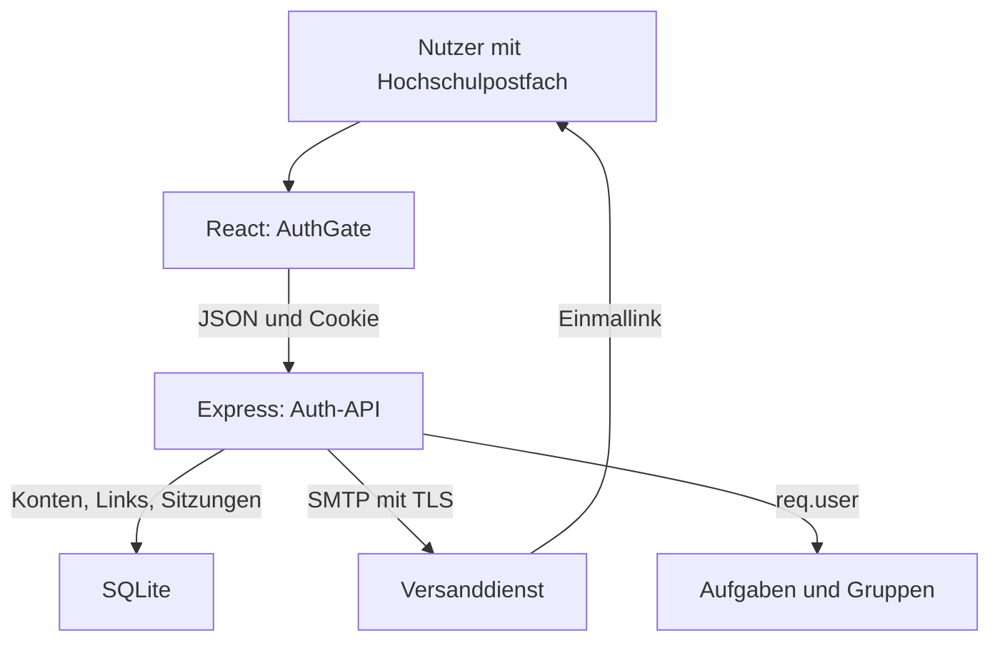
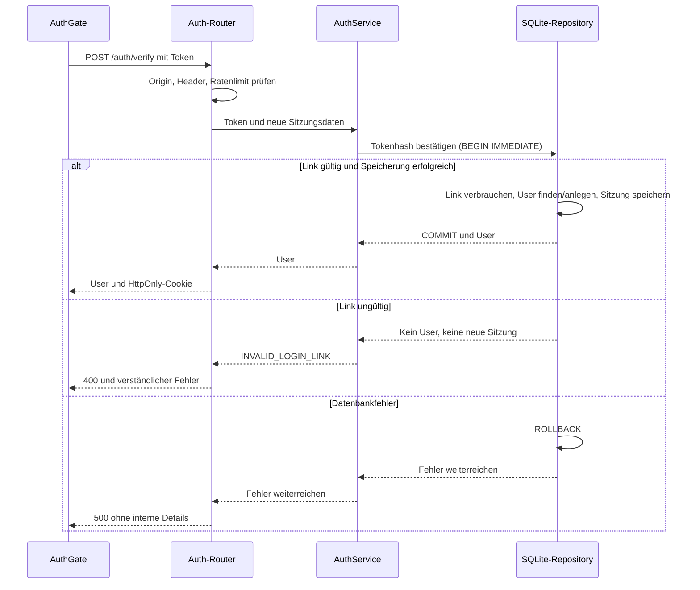

# Architektur des Anmeldebereichs

Stand: 24.09.2026. arc42-Beitrag für UC-01; beschreibt den Anmeldebereich,
nicht die vollständige Architektur der Aufgaben, Gruppen und Priorisierung.

## 1. Einführung und Ziele

StudyPrio soll Nutzer anhand ihrer Hochschul-Mailadresse wiedererkennen und
geschützte Aktionen einer stabilen Nutzer-ID zuordnen. Ziele sind widerrufbare
Sitzungen, verständliche Fehler und ein Ablauf, den die Gruppe selbst erklären
kann. Anmeldung und Berechtigung bleiben getrennt: Ein gültiger Login allein
erlaubt noch keinen Zugriff auf fremde Aufgaben.

## 2. Randbedingungen

Gemeinsamer Stack: JavaScript/ES-Module, React/Vite, Express und SQLite.
Kein Firebase und keine bereitgestellte THM-SSO-Anbindung. Deshalb werden keine
Uni-Passwörter erfasst. Das Projekt verwendet denselben Browser-Origin für
Oberfläche und API. Es gibt noch keinen geprüften öffentlichen Serverbetrieb.

## 3. Systemkontext

Quelle des Diagramms: eigener Aufbau aus AuthGate, app.js und Auth-Modulen.
Der externe Dienst transportiert die Mail; Tokenprüfung und Sitzung liegen in
StudyPrio. Im lokalen Modus ersetzt Terminalausgabe den Versanddienst.

## 4. Lösungsstrategie

Kleine Module mit übergebenen Abhängigkeiten statt globalen Nutzern/Testrechten.
Einmal-Link und Sitzung sind zufällige Geheimnisse, SQLite speichert ihre Hashes.
Eine Transaktion verbindet Bestätigung und Sitzung. Der Mailadapter lässt sich
für Tests austauschen, die fachliche Prüfung bleibt dabei dieselbe.

## 5. Bausteinsicht

- authService: E-Mail prüfen, Link erzeugen und bestätigen.
- authRepository: SQLite-Zugriffe, Transaktionen, Sitzungen und Ratenlimits.
- sessionService: Sitzungstoken und Cookie.
- authRoutes: HTTP-Endpunkte, requireAuth und Schutz schreibender Anfragen.
- mailer: lokaler Testadapter oder Nodemailer mit SMTP/TLS.
- authConfig: Einstellungen aus der Umgebung prüfen.
- app.js: Bausteine verbinden; server.js: Server starten und alte Daten bereinigen.
- AuthGate: Loginformular, explizite Bestätigung, Sitzungsprüfung und Logout.
- AuthContext/useAuth: angemeldeten Nutzer und Logout an die anderen Ansichten weitergeben.

## 6. Laufzeit und Datenbank

Jeder Repository-Aufruf öffnet eine eigene Verbindung und schließt sie wieder.
Bei Bestätigung: BEGIN IMMEDIATE, gültigen Link verbrauchen, Konto finden/anlegen,
neue Sitzung speichern und ggf. die bisherige Browsersitzung löschen, COMMIT.
Bei Fehler: ROLLBACK. So gibt es weder doppelte Linkverwendung noch ein verbrauchtes
Token ohne Sitzung. SQLite-Schreibzugriffe warten höchstens fünf Sekunden.

Die Migrationen sind wiederholbar. Auth wird vor Kommentaren angelegt.
Abgelaufene Links, Sitzungen und Ratenlimits werden beim Start und alle 15 Minuten
bereinigt. Konten bleiben erhalten.

Nach Mailanforderung und Öffnen des Links läuft die Bestätigung so ab:

Quelle: authRoutes.js, authService.js, authRepository.consumeLoginToken.
Das Token wird nicht schon durch GET verbraucht. SMTP-Versand findet vorher
außerhalb dieser Transaktion statt und hat feste Verbindungszeitlimits.

## 7. Verteilung und Betrieb

Lokal laufen Vite auf localhost:5173 und Express auf 127.0.0.1:3000. Vite leitet
/api zum Backend weiter. Die SQLite-Datei liegt standardmäßig im Backend-Verzeichnis;
DATABASE_PATH erlaubt eine andere Datei. Ein eigener DB-Handle pro Repository-Aufruf
verhindert überlappende Transaktionen auf derselben Verbindung.

Für einen öffentlichen Betrieb ist ein HTTPS-Reverse-Proxy vorgesehen, der
Frontend-Dateien und /api unter derselben Origin bereitstellt. APP_ORIGIN muss
dazu passen, NODE_ENV=production und MAIL_MODE=smtp gelten. Der Frontend-Build
allein startet kein Backend. Diese Verteilung ist beschrieben, noch nicht deployt.
Konfiguration und Start: [INSTALL.md](../../INSTALL.md).

## 8. Querschnittliche Konzepte

### Schutz

Link- und Sitzungstoken bestehen aus 32 zufälligen Bytes; gespeichert wird SHA-256.
Der Linktoken liegt im URL-Fragment. Die Oberfläche liest ihn in ihren Zustand,
entfernt ihn aus der Adressleiste und sendet ihn erst nach Bestätigung per POST.
Nach einem Neuladen der Bestätigungsseite muss der Link aus der Mail erneut geöffnet werden.

Cookies: HttpOnly, SameSite=Lax, Path=/, sieben Tage; bei HTTPS zusätzlich Secure
und __Host-Präfix. Kein Domain-Attribut und kein Token im LocalStorage.
Jeder neue Login ersetzt die mitgesendete bisherige Sitzung.

Schreibende APIs benötigen passenden Origin, JSON und X-StudyPrio-Request: 1.
Es gibt keine Freigabe fremder Origins per CORS. Das schützt gegen CSRF,
einschließlich fremder Login- und Logout-Formulare. API-Antworten sind nicht cachebar.
Ratenlimits liegen in SQLite und überstehen Neustarts. Forwarded-IP-Header werden
nicht vertraut; hinter einem Proxy gilt zunächst dessen IP für alle Nutzer.
Proxykonfiguration ist vor einem öffentlichen Betrieb gesondert abzustimmen.

SMTP nutzt TLS mit Zertifikatsprüfung und Zeitlimits. Der lokale Modus ist in
Produktion und mit öffentlicher App-Origin gesperrt; der Server bindet darin
ausschließlich an 127.0.0.1. Testlinks dürfen nicht weitergegeben werden.
Unbekannte Fehler geben keine Datenbank- oder SMTP-Details an Clients weiter.

### Schnittstellen für die anderen Bereiche

createApp liefert neben app das Middleware requireAuth und userDirectory zurück.
requireAuth setzt req.user mit id, email, emailVerifiedAt, createdAt.
userDirectory.findVerifiedByEmail(email) ist asynchron und nur serverintern,
beispielsweise für eine bereits berechtigte Mitgliederverwaltung.
Ungültige, nicht erlaubte und unbekannte Adressen liefern null; Datenbankfehler
werden weitergegeben. So kann der Gruppenrouter einen unbekannten Nutzer melden.

Der synchrone Callback mountFeatures(app, {openDb, requireAuth, userDirectory})
montiert weitere Routen vor Fallback und 404-Behandlung. Sein Rückgabewert steht
unter runtime.features zur Verfügung, etwa für taskService. Verbindungen, die
vorher benötigt werden, öffnet der Aufrufer. Konkretes Beispiel und Team-Test:
[Integration](../auth-integration.md).

HTTP-Datenformat: { data: ... } oder { error: { code, message, fields? } }.
Auth-Fehler verwenden code/message; fields aus Fachmodulen gibt der Client weiter.
Für schreibende Frontend-Aufrufe frontend/src/api.js verwenden.
Der Client sendet auch bei DELETE ohne expliziten Body ein JSON-Objekt. Bei 401
aus geschützten Modulen benachrichtigt er AuthGate. Die geschützte Ansicht wird
dann entfernt und die erneute Anmeldung angeboten.
Kommentare sind bis zur Integration echter Aufgabenrechte gesperrt. Ahshans
Kommentarcode bleibt erhalten. Seine Rechteprüfungen benötigen beim Anschluss
await; zusätzlich ist der Vertrag Task-ID oder Taskobjekt gemeinsam festzulegen.

### Migration und Grenzen

Installation und API-Liste: INSTALL.md. Es gibt noch keinen produktiven Deployment-Test.
Die Migration ist kein allgemeines versioniertes Framework; _migrations aus
dem Grundgerüst wird bisher nicht als Versionshistorie verwendet.
Echte Zustellung und der Login-/Logout-Ablauf wurden von Jaouad auf Windows
mit Gmail und seinem THM-Postfach geprüft. Die gemeinsame Gesamtintegration ist offen.
Aufgaben-/Gruppenrechte wurden am 24.09. im gemeinsamen Prüfaufbau getestet;
Kommentarrechte und endgültige Montage bleiben offen. auth_settings bindet die
Datenbank an local oder smtp. Beim Wechsel ist eine neue Datenbank erforderlich,
damit lokal erzeugte Konten und Sitzungen nicht in den echten Betrieb gelangen.

## 9. Architekturentscheidungen

- [E-Mail-Link statt Passwort/Firebase/SSO](../adr/auth-anmeldung.md)
- [Sitzungen in SQLite statt Arbeitsspeicher/JWT](../adr/auth-sitzungen.md)
- [Lokaler Mailmodus und getrennte Datenbanken](../adr/auth-mailmodus.md)

Die Entscheidungen beschreiben den Auth-Beitrag. Entscheidungen zu weiteren
Projektteilen werden von deren Verantwortlichen ergänzt. Kapitel 10 und 11
entfallen nach Kursvorgabe.

## 12. Glossar

**Origin:** Protokoll, Host und Port einer Browseradresse.
**CSRF:** Fremde Seite löst eine Aktion mit der bestehenden Browsersitzung aus.
**HttpOnly:** Browser-JavaScript kann das Cookie nicht auslesen.
**Transaktion:** Zusammengehörige DB-Änderungen werden gemeinsam übernommen oder zurückgesetzt.
**STARTTLS:** Wechsel einer SMTP-Verbindung auf TLS vor Anmeldung und Versand.
**requireAuth:** Middleware, die die Sitzung prüft und req.user bereitstellt.

## Eingesetzte KI-Werkzeuge

ChatGPT/Codex für Entwurf, Umsetzung, Testentwurf und Dokumentation.
Automatisierte Tests prüfen reale temporäre SQLite-Datenbanken und HTTP-Aufrufe.
Die zusätzliche SMTP-Prüfung verwendet echten Nodemailer und einen lokalen
SMTP-Server mit temporärem Zertifikat. Erfolgreiche und abgewiesene TLS-Verbindungen
sind geprüft. Separat hat Jaouad den manuellen Gmail-Versandtest bestätigt,
wie im [Abschlussbericht](../auth-abschluss.md) dokumentiert.
Code, Diagramme, Datennamen und Testaussagen wurden gegeneinander abgeglichen.
Jaouads eigene Codeprüfung und Erklärung stehen noch aus.

Quellen: [Node crypto](https://nodejs.org/api/crypto.html),
[SQLite RETURNING](https://www.sqlite.org/lang_returning.html),
[Nodemailer SMTP](https://nodemailer.com/smtp).
