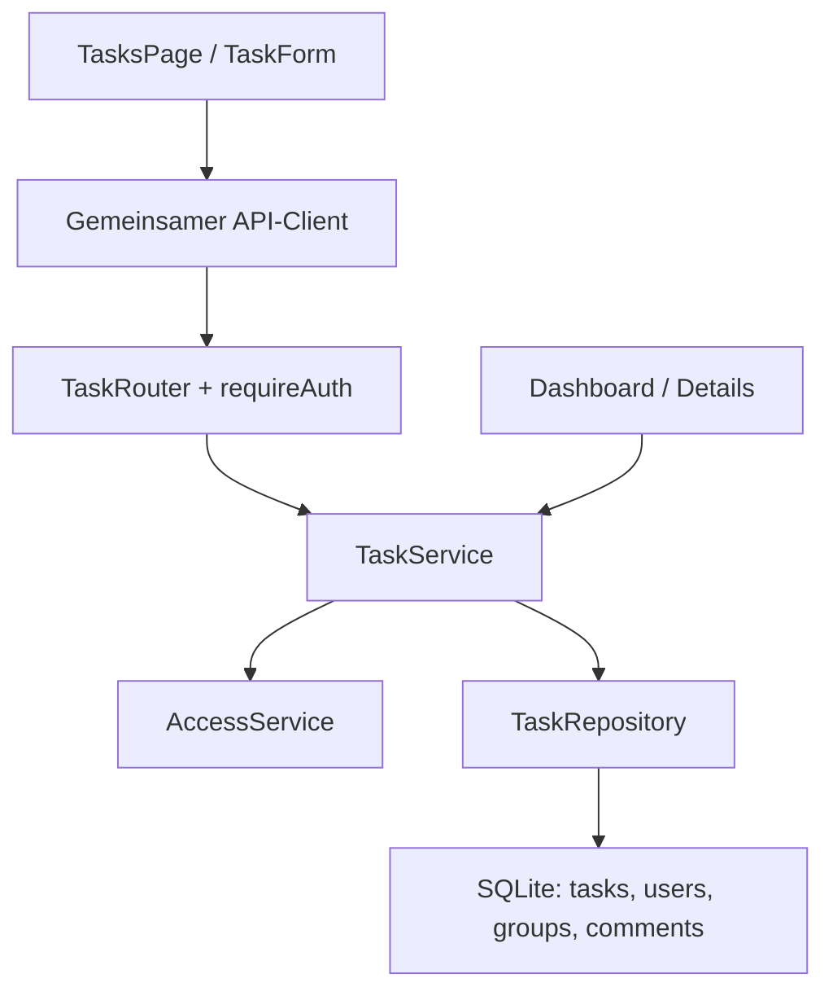

# StudyPrio – Architektur der Aufgabenverwaltung

Stand: 24.09.2026. Modulbeitrag für Amin; [Spec](../spec/tasks.md),
[Übergabe](../tasks-handoff.md). A01–A09/A12 beschreiben diesen Baustein;
sie ersetzen nicht die teamweite Architektur.

## A01 – Ziele

Nachvollziehbare Aufgaben-CRUD-Abläufe, dauerhaft gespeicherte Daten und dieselben
Zugriffsregeln für HTTP sowie Service-Consumer. Ein verlorenes Gruppenrecht darf
nicht durch Eigentümerschaft umgangen werden. Automatisierte Akzeptanzprüfungen
und verständliche, kleine Module ermöglichen Amins Walkthrough.

## A02 – Randbedingungen

JavaScript/ES-Module, React/Vite, Express 4, SQLite mit bestehenden `sqlite/sqlite3`-
Abhängigkeiten. Keine neue Laufzeitabhängigkeit im Task-Paket. Jaouads Sitzung setzt
`req.user`; Haizams AccessService wird injiziert. Keine Änderungen an fremden
Rootdateien in diesem Arbeitspaket. Geprüfte Basen und noch offene Montageschritte
stehen in der Übergabe. Die Nutzerangabe Firebase ist durch die neuere Teamentscheidung
und den vorhandenen SQLite-Code überholt.

## A03 – Kontext

Aufgabenoberfläche nutzt den gemeinsamen API-Client. Jaouads Auth-Middleware schützt
die Task-Routen; Haizam beantwortet Mitgliedschaft und Rechte. Bassim und Ahshan
lesen Tasks über den TaskService, nicht ungeprüft per Repository. Kommentar-FK bleibt
Eigentum von Ahshans Modul. Gruppen-IDs und Nutzer-IDs referenzieren dieselbe SQLite-Datei.

## A04 – Lösungsstrategie

Router für HTTP, Service für Regeln/Autorisierung, Repository für SQL und Transaktionen.
`taskModule.js` baut Service und Router gemeinsam auf. `TasksWorkspace.jsx` beschafft
Gruppen über die echte Gruppen-API und bindet `TasksPage` ein; die Gruppenverwaltung
bleibt bei Haizam. [Team-Anschluss](../tasks-team-integration.md).
Dependencies werden als Objekte übergeben, damit das Modul ohne Import einer
startenden Serverdatei testbar bleibt. Beide öffentlichen Lese-Services laufen durch
denselben Prüfpfad wie HTTP. Fehlende Auth-/Access-Abhängigkeiten verhindern den
Aufbau statt permissive Defaults zu liefern.

## A05 – Bausteine und Rückverfolgbarkeit

| Spec | Frontend | Backend | Wesentliche Tests |
|---|---|---|---|
| TASK-01/02 | `TasksPage.jsx`, `taskApi.js` | `taskRoutes.js` → `listVisible/getVisibleById` | fremde persönliche Task, Nichtmitglied, entfernter Ersteller, Statusfilter |
| TASK-03 | `TaskForm.jsx`, `taskFormModel.js` | `validateTaskInput` → `create` → `insert` | Pflicht-/Typ-/Bereichsprüfung, Kalender, Eigentümer/UTC |
| TASK-04 | `TaskDialog.jsx`, `TaskForm.jsx` | `update` mit geschützter Schreibtransaktion | immutable Felder, Status, parallele PATCHes |
| TASK-05 | Bestätigungsdialog in `TasksPage.jsx` | `remove` → SQL DELETE → FK-Kaskade | Abbruch/Bestätigung im Browser; echte Kommentar-Kaskade in SQLite |
| D1/D2/S2 | – | `taskMigration.js` | Wiederholung, fehlende Referenzen, FK-Fehler |



Diagrammquelle: eigene Darstellung im mitgelieferten Mermaid-Quelltext.

## A06 – Laufzeit: Aufgabe bearbeiten

```mermaid
sequenceDiagram
    participant UI as Formular
    participant R as Router + Auth
    participant S as TaskService
    participant A as AccessService
    participant DB as SQLite
    UI->>R: PATCH /api/tasks/:id
    R->>R: Sitzung und Schreibschutz
    R->>S: update(userId, id, changes)
    S->>DB: BEGIN IMMEDIATE; Task lesen
    S->>A: Mitgliedschaft + canWriteTask(userId, task)
    A-->>S: boolean oder Fehler
    alt erlaubt und Payload gültig
      S->>DB: UPDATE; COMMIT
      S-->>R: gespeicherte Task
      R-->>UI: 200 data
    else verboten oder ungültig
      S->>DB: ROLLBACK
      S-->>R: TaskError
      R-->>UI: 403 oder 400 error
    end
```

Fehlende Task führt zu 404 und Rollback. DELETE verwendet denselben Prüfweg;
die Kommentar-Löschung übernimmt SQLite innerhalb derselben Transaktion.

## A07 – Verteilung und Start

Browser → gemeinsamer Vite-/Produktiv-Webserver → Express → lokale SQLite-Datei.
Die Entwicklung nutzt den vorhandenen `/api`-Proxy. Produktionshosting ist kein
Bestandteil dieses Beitrags. SQLite-Datei muss im Teamstart dauerhaft und schreibbar
liegen, und alle Module müssen denselben `openDb` verwenden. Keine eigene zweite DB.

Die isolierte Testansicht bindet nur `127.0.0.1:5174`; ihr Backend nutzt einen freien
Loopback-Port, der bei Start an Vite übergeben wird. Fiktive Testkonten und Gruppen
leben in temporären Dateien, die bei regulärem Beenden gelöscht werden. Diese
Test-App wird nicht in die produktive Router-Montage übernommen.

## A08 – Querschnitt

- **Validierung:** API erwartet JSON-Objekte, prüft erlaubte Feldnamen, Typen, endliche
  Zahlen, Bereich und tatsächliches Kalenderdatum. SQL ergänzt CHECK/NOT NULL/FK.
  Die maximale JS-Textlänge zählt UTF-16-Codeeinheiten; SQL `length` zählt Codepoints
  und ist nur eine zusätzliche Schranke, kein Ersatz der Servervalidierung.
- **Autorisierung:** Zuerst existierende Task laden, dann persönliche Eigentümerschaft
  bzw. aktuelle Gruppenmitgliedschaft und AccessService-Ergebnis prüfen. Nur `true`
  erlaubt. Die Unterscheidung 403/404 verrät die Existenz einer erratenen ID; sie folgt
  dem gemeinsamen API-Vertrag. UUIDs reduzieren erratbare IDs, ersetzen aber keine Rechte.
- **Transaktionen:** Pro Repository-Aufruf eine eigene Verbindung. `BEGIN IMMEDIATE`
  startet vor dem Lesen/Prüfen einer Schreiboperation und reserviert SQLite-Schreibzugriff.
  Auch Mitgliedschaftsänderungen in derselben DB müssen sich dahinter einordnen.
  Haizams Prüfmethoden dürfen dabei nur lesen und keine eigene Schreibtransaktion
  anfordern; sonst drohen Wartezyklen. Haizams verfügbare Methoden wurden als reine
  Leser geprüft und in den Team-Anschlusstests erfolgreich eingesetzt.
- **Nebenläufigkeit:** Die aktuelle Task wird innerhalb der Schreibtransaktion gelesen;
  unabhängige PATCH-Felder gehen nicht durch voriges Lesen verloren. Das Formular
  sendet nur veränderte Werte. Bei Änderungen desselben Feldes gilt letzter erfolgreicher
  Schreibzugriff. Kein ETag-/Versionsvergleich. Listen werden ohne gemeinsamen Snapshot
  geladen; maßgeblich für eine spätere Mutation ist deren erneute Rechteprüfung.
- **Fehler:** TaskError hat HTTP-Status, Code, Nachricht, optionale Feldfehler. Authfehler
  verbleiben in Jaouads Middleware; unerwartete SQL-Fehler im gemeinsamen Fehlerhandler.
  `SQLITE_BUSY` wird nach maximaler Wartezeit von 5 Sekunden als 503 zurückgegeben.
- **UI:** Erfolg erst nach Serverantwort. Keine optimistische Löschung. Native Dialoge,
  Labels und Status-/Alarmbereiche. Veraltete Listenladeantworten werden per laufender
  Anfragenummer ignoriert. Ein Ref blockiert doppelte Mutationen auch vor Reacts Re-Render.
  `TaskForm` gleicht eine gewählte Gruppen-ID mit der erneut geladenen Liste ab;
  fehlende Gruppen bleiben als ungültige Auswahl sichtbar, bis der Nutzer umwählt.
  Eine erfolgreiche Neuanlage setzt den Filter auf „Alle Aufgaben“.
- **Datenzugriff:** SQL-Werte sind parametrisiert; Feldnamen im SQL sind fest. Fremde
  Fachmodule verwenden die rechteprüfenden Services. API-Client und Gruppenliste sind
  Frontend-Dependencies; keine erfundenen produktiven Nutzer-Header oder Fallback-Rechte.

## A09 – Entscheidung

[ADR-TASK-01: Aufgaben in der gemeinsamen SQLite-Datenbank](../adr/tasks-persistence.md).
Dies ist ein konkreter Persistenzbeitrag zu den insgesamt geforderten 3–5 ADRs.
Die übrigen projektweiten Entscheidungen müssen die zuständigen Teammitglieder
beisteuern bzw. mit bestehenden ADRs konsolidieren.

A10/A11 entfallen nach Kursvorgabe. Offene Integration ist als tatsächlicher Stand
in der Übergabe beschrieben, nicht als angeblich fertige Gesamtabnahme.

## A12 – Glossar

Repository = SQL-Zugriff. Service = fachliche Regeln. Routerfabrik = erstellt Router
mit übergebenen Dependencies. FK-Kaskade = abhängige Kommentare mitlöschen.
`BEGIN IMMEDIATE` = SQLite-Transaktion mit reserviertem Schreibzugriff.

## Eingesetzte KI-Werkzeuge

ChatGPT/Codex am 23.–24.09.2026 für Architektur, Implementierung, Tests und Diagramme.
Abgleich gegen aktuellen `main`, Jaouads Auth-Branch und den Arbeitsauftrag.
Tatsächlich ausgeführte Prüfungen stehen im [Prüfprotokoll](../tasks-verification.md).
Am 23.09. waren nur Test-Gruppenadapter verfügbar; seit 24.09. wurde zusätzlich
Haizams echtes Gruppenmodul in HTTP- und Browserprüfungen verwendet. Die gemeinsame
Root-Montage steht weiter aus. Menschliche Prüfung und Erklärung durch Amin sind offen.

Quellen: [Kurs-README](https://github.com/carstenlucke/thm_wkb_wk-1106/blob/main/README.md),
[Bewertung](https://github.com/carstenlucke/thm_wkb_wk-1106/blob/main/BEWERTUNG.md),
jeweils gelesen am 23.09.2026; tatsächliche Team-Commitstände siehe Übergabe.
