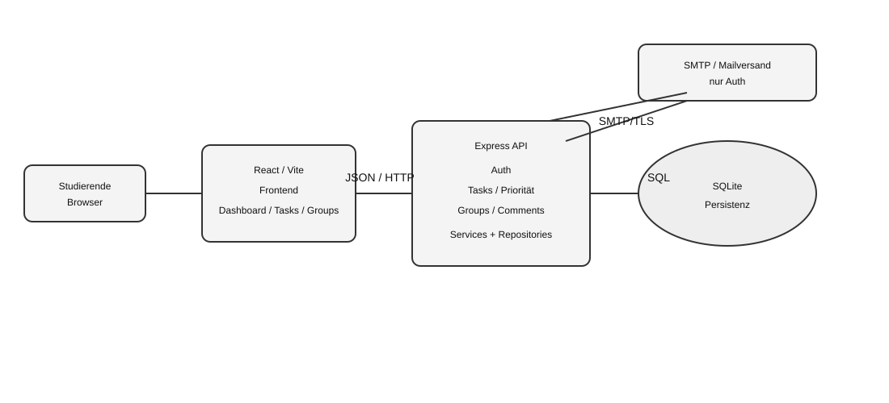
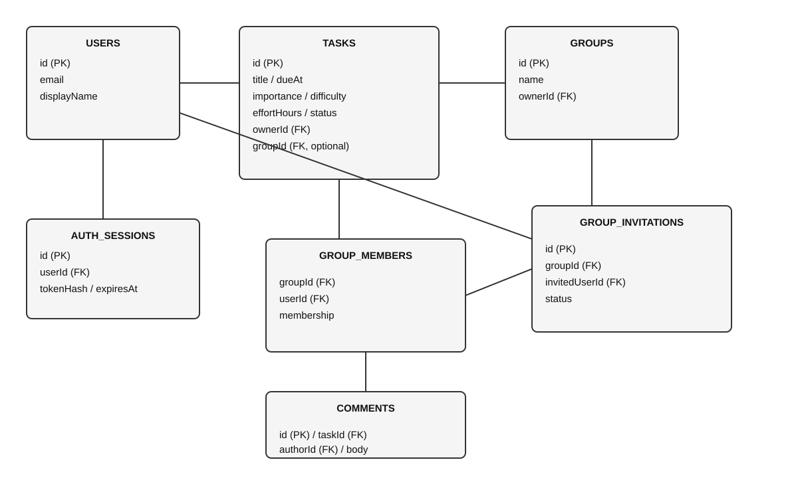

# StudyPrio – Architekturbeschreibung nach arc42

**Stand:** 25.09.2026

## 1. Einführung und Ziele
StudyPrio trennt Browseroberfläche, HTTP-Schnittstellen, fachliche Services und Persistenz. Ziele sind fachliche Modularisierung, serverseitige Regeln, lokale Testbarkeit und nachvollziehbare Datenhaltung.

## 2. Randbedingungen
JavaScript/ES-Module, React 18, Vite 5, Node.js, Express 4, SQLite, JSON/HTTP. Auth erfolgt über E-Mail-Einmallinks; offizielles SSO ist nicht Bestandteil. M3 zielt auf lokalen Einzelserverbetrieb.

## 3. Kontextabgrenzung

Die Browseranwendung kommuniziert mit Express. Express verwendet SQLite und im SMTP-Modus einen Mailversanddienst. Reproduzierbare Diagrammquellen liegen als Mermaid-Dateien neben den SVGs.

## 4. Lösungsstrategie
- Fachmodule für Auth, Tasks, Groups und Comments.
- Grundsätzlich Route → Service → Repository/Migration.
- Dependency Injection über die App-Fabrik.
- Servervalidierung, Berechtigung und Priorität im Backend.
- Transaktionen bei kritischen konkurrierenden Änderungen.
- React Context/Hooks für Auth- und UI-Zustand.
- isoliert testbare Fachlogik.

## 5. Bausteinsicht

### 5.1 Gesamtsystem
Browser/React → JSON/HTTP → Express API → SQLite.

### 5.2 Frontend
AuthGate/AuthContext, Dashboard, TasksPage, GroupsPage und Kommentar-/UI-Komponenten. Der gemeinsame API-Client kapselt JSON-Anfragen und Sessionfehler.

### 5.3 Backend
- **Auth:** Routes, Service, Repository, Session-Service und Mailer.
- **Tasks:** `taskRoutes.js`, `taskService.js`, `taskRepository.js`, `taskPriority.js`, `taskValidation.js`, `taskMigration.js`.
- **Groups:** Group Service und Invitation Service; `group_members` ist die maßgebliche Quelle der aktuellen Mitgliedschaft.
- **Comments:** `commentRoutes.js` kapselt die HTTP-Schnittstelle. Die Route nutzt `taskService` für die Aufgabenberechtigungsprüfung und `openDb` für das direkte Lesen/Schreiben der Kommentarzeilen. Eine separate Comment-Service-/Repository-Schicht ist im M3-Stand nicht vorhanden.

Die Architektur-Komponenten entsprechen den beschriebenen Codepfaden; Details der Use-Case-Zuordnung stehen in [traceability.md](traceability.md).

## 6. Laufzeitsichten

### 6.1 Aufgabe erstellen
TasksPage → API Client → POST /api/tasks → taskRoutes → taskService → Validierung/Access → taskRepository → SQLite → Antwort.

### 6.2 Priorisierung
GET /api/tasks → taskService.listTasks → zugängliche Aufgaben → calculateTaskPriority → Sortierung nach Score DESC und dueAt ASC → JSON → TasksPage.

### 6.3 Gruppen
Einladung wird als pending gespeichert. Annahme schreibt group_members und den Einladungsstatus transaktional. Owner-Austritt mit Nachfolge oder Auflösung ist ebenfalls transaktional.

### 6.4 Auth
Anmeldelink anfordern → explizit bestätigen → User/Sitzung transaktional speichern → HttpOnly-Cookie. Detaillierte Auth-Dokumentation: [docs/auth-integration.md](auth-integration.md).

## 7. Verteilung
Lokal: Browser :5173 → Vite → /api → Express :3000 → SQLite. SMTP-Modus: Express → TLS/SMTP → Mailanbieter. Öffentlicher Betrieb ist als HTTPS-Reverse-Proxy-Ziel dokumentiert, nicht als produktiver Deployment-Nachweis.

## 8. Querschnittliche Konzepte
**Sicherheit:** HttpOnly-Cookie, zufällige Token und Hashes, Origin-/Header-Prüfung, serverseitige Rechte, Ratenlimits.

**Validierung:** Backend validiert fachliche Eingaben; Frontend ergänzt Benutzerfeedback.

**Fehler:** strukturierte error.code/message/fields; keine internen DB-/SMTP-Details.

**Persistenz:** Foreign Keys, Indizes und Transaktionen.

**Priorität:** reine Fachfunktion in `taskPriority.js`, dadurch isoliert testbar.

**Frontend:** Feature-Struktur, API-Client und AuthContext/useAuth.

## 9. Architekturentscheidungen
- [ADR: E-Mail-Link](adr/auth-anmeldung.md)
- [ADR: SQLite-Sitzungen](adr/auth-sitzungen.md)
- [ADR: lokale/SMTP-Modi](adr/auth-mailmodus.md)
- [ADR: Frontend/Backend-Trennung](adr/frontend-backend-architecture.md)
- [ADR: SQLite-Persistenz](adr/persistence-sqlite.md)

Jede Entscheidung dokumentiert Kontext, Alternativen, Entscheidung, Begründung und Konsequenzen.

## 10. Qualitätsanforderungen
| Qualität | Architekturmaßnahme | Nachweis |
|---|---|---|
| Sicherheit | HttpOnly, Session-Hash, serverseitige Rechte, Origin-Prüfung | Auth-/HTTP-Tests |
| Testbarkeit | reine Priority-Funktion, modulare Services, temporäre DBs | Unit-/Integrationstests |
| Wartbarkeit | Feature-Module und klare Service-/Repository-Grenzen | Code-Struktur |
| Datenkonsistenz | Foreign Keys und Transaktionen | Migration-/Integrationstests |
| Inbetriebnahme | Node/npm/SQLite, wiederholbare Migration | INSTALL.md |

## 11. Risiken und technische Schulden
- SQLite ist für einen einzelnen Backend-Prozess passend, nicht als Ziel für horizontal verteilte Instanzen.
- Kommentare besitzen im M3-Stand noch keine eigene Service-/Repository-Schicht.
- Öffentlicher VM-Betrieb wurde nicht als produktiver Nachweis abgenommen.
- Priorität ist eine projektspezifische Heuristik und keine wissenschaftlich validierte Lernplanung.
- Das System besitzt kein offizielles THM-SSO.

## 12. Glossar
Task = Aufgabe. Priority Score = numerische Priorität. Owner = Gruppenleitung. Membership = group_members-Eintrag. Session = serverseitige Anmeldung. Repository = Datenbankzugriff. Service = Fachlogik.

## KI-Einsatz
Im Projekt wurden **ChatGPT Astra**, **Claude Sonnet 5** und **GPT-5.6 Terra** als unterstützende KI-Werkzeuge eingesetzt. Sie dienten unter anderem für Architekturentwürfe, Code-/Testideen und Dokumentation. Die Architektur wurde anschließend anhand der tatsächlichen Dateien, Schnittstellen, Datenstrukturen und Tests abgeglichen. Nicht implementierte Funktionen werden nicht als vorhanden dargestellt.
