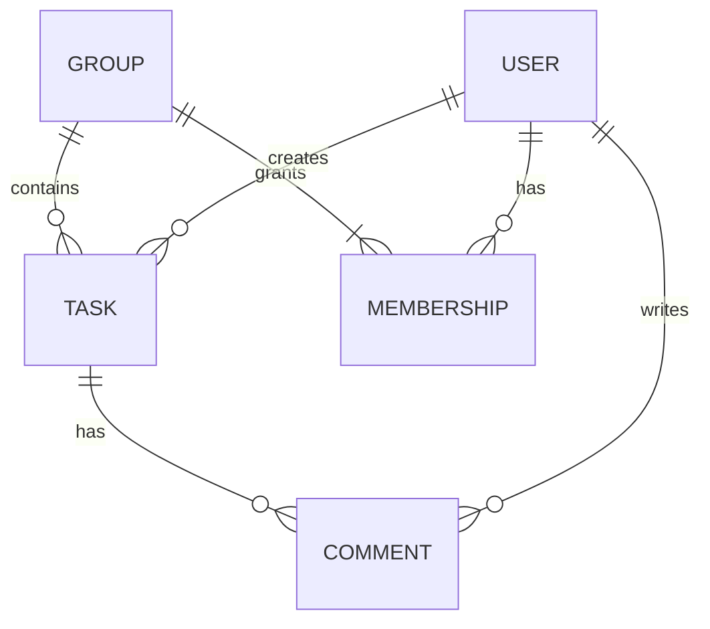

# StudyPrio – Spezifikation

**Status: fachlicher Entwurf, vom Team zu prüfen. Kein Implementierungsnachweis.**

## P1 Ziele und Rahmenbedingungen

Studierende erfassen Aufgaben und erkennen, welche unerledigten Aufgaben zuerst
Aufmerksamkeit brauchen. Der Score ist eine Empfehlung, keine Garantie für
Lernerfolg. Gruppen organisieren Aufgaben und Kommentare. Stakeholder sind
Studierende, Gruppenmitglieder und Projektteam; der Dozent bewertet die Ergebnisse.
M3: 25.09.2026. Angemeldet: JavaScript, React/Vite, Firebase Auth/Firestore.
Ergänzungsvorschlag: eigene API für Logik und Berechtigungen.

## P2 Architekturüberblick

React stellt Dialoge dar. Die API prüft Tokens, Eingaben und Rechte und verwaltet
Firestore-Daten. Firebase Auth verwaltet Konten. Priorisierung ist ein separates
Fachmodul. Details: [Architektur](../arch/README.md).

## F1 Geschäftsprozesse

Persönlich planen: anmelden, Aufgabe erfassen, Prioritäten ansehen, Bearbeitung
beginnen, erledigen. Zusammenarbeit: Gruppe erstellen, registrierte Mitglieder
hinzufügen, Gruppenaufgabe erfassen, kommentieren, Status aktualisieren.
Erledigte Aufgaben bleiben im Erledigt-Filter sichtbar.

## F2 Anwendungsfälle

| ID | Voraussetzung | Ablauf / Ergebnis | Fehlerfall / Akzeptanz |
|---|---|---|---|
| UC-01 Konto/Anmeldung | Besucher | E-Mail/Passwort registrieren, anmelden, abmelden | Verständliche Fehler; nach Abmelden keine geschützte Anfrage möglich |
| UC-02 Aufgabe anlegen | Angemeldet | D2-Felder eingeben, persönlich oder zugängliche Gruppe wählen, speichern | Ungültige Werte abweisen; nach Neuladen gleicher Inhalt |
| UC-03 Aufgabe ändern/löschen | Persönlicher Eigentümer oder Gruppenmitglied | Werte/Status bearbeiten; Löschen bestätigen | Abbrechen erhält Task; fremde ID abweisen; Änderung dauerhaft |
| UC-04 Prioritäten ansehen | Angemeldet | Eigene und zugängliche Gruppenaufgaben sortiert ansehen, Status filtern | Erledigte fehlen in aktiver Liste; Score/Reihenfolge folgen PRIO-01 |
| UC-05 Gruppe verwalten | Angemeldet; Mitgliederverwaltung nur Besitzer | Gruppe anlegen, registriertes Konto per E-Mail hinzufügen/entfernen | Keine doppelten Mitglieder; Besitzer nicht entfernbar; Nichtbesitzer abweisen |
| UC-06 Gruppenaufgabe bearbeiten | Gruppenmitglied | Gruppenaufgabe anlegen, lesen, ändern, löschen | Nichtmitglieder haben keinen Zugriff; Entfernung entzieht Autor ebenfalls Zugriff |
| UC-07 Kommentieren | Gruppenmitglied, bestehende Gruppenaufgabe | Nichtleeren Kommentar senden, chronologisch lesen | Ungültigen Text/Nichtmitglied abweisen; nach Neuladen vorhanden |

UC-02 Normalablauf: Formular öffnen, ausfüllen, senden; API validiert und prüft
gegebenenfalls Mitgliedschaft, speichert; UI aktualisiert Liste. Bei Netzfehler
bleiben Eingaben erhalten, es erscheint keine Erfolgsmeldung.
UC-06 verwendet denselben Task-Service wie persönliche Aufgaben.

## F3 Anwendungsfunktionen

F2 definiert CRUD und Status. [PRIO-01](priority.md) definiert den Algorithmus.
Alle Gruppenmitglieder dürfen Gruppenaufgaben ändern/löschen; keine zusätzliche
Personenzuweisung. Kommentare sind in der Erstversion unveränderlich. Tasklöschung
entfernt auch Kommentare. Gruppenlöschung und Aufgabentransfer sind nicht vorgesehen.

## D1 Datenmodell

Logische Typen: User (Firebase-Konto), Group, Membership, Task, Comment.
Physisch: groups/{groupId} mit ownerId/memberIds; tasks/{taskId};
tasks/{taskId}/comments/{commentId}. Membership ist die logische Beziehung,
keine zusätzlich gepflegte Collection. Persönliche Tasks haben groupId=null.
Zugriff auf Gruppenaufgaben folgt Mitgliedschaft, auch für ursprüngliche Autoren.

## D2 Datentypenverzeichnis

| Feld | Werte / Regel |
|---|---|
| User.id | Firebase UID; keine eigenen Passwortdaten |
| Task.id, Group.id, Comment.id | Serverseitig erzeugte IDs |
| Task.title | Getrimmt, 1–120 Zeichen |
| Task.description | Max. 2.000 Zeichen; leer erlaubt |
| Task.dueAt | ISO-8601-Zeitpunkt mit Zeitzone; Firestore Timestamp bei Speicherung |
| Task.importance, Task.difficulty | Ganze Zahl 1–5 |
| Task.effortHours | Endliche Zahl 0,25–200 Stunden |
| Task.status | open, in_progress, done; Startwert open |
| Task.ownerId | Ersteller-UID; serverseitig gesetzt, unveränderlich |
| Task.groupId | Zugängliche Gruppen-ID oder null; nach Erstellung unveränderlich |
| Group.name | Getrimmt, 1–80 Zeichen |
| Group.ownerId, Group.memberIds | Besitzer-UID, eindeutige UID-Liste einschließlich Besitzer |
| Comment.taskId, Comment.authorId | Task-ID und serverseitig gesetzte Autor-UID |
| Comment.body | Getrimmt, 1–1.000 Zeichen |
| createdAt, updatedAt | Serverzeit; Task/Group beide, Comment nur createdAt |

IDs, Eigentümer und Zeitstempel aus Client-Payloads nicht übernehmen; unbekannte
Felder zurückweisen. Scores werden berechnet und nicht dauerhaft gespeichert.

## B1 Dialogspezifikation

Login: E-Mail, Passwort, Aktion, Fehler. Dashboard: Titel, Deadline, Status,
Score und vier Beiträge; Statusfilter; „Aufgabe anlegen“. Formular: D2-Felder,
Gruppe, Speichern/Abbrechen; Fehler am Feld. Detail: Bearbeiten, Status,
Löschbestätigung; Gruppenaufgabe zusätzlich Kommentare. Gruppenansicht: Name,
Mitglieder, Aufgaben; Besitzer kann registriertes Konto per E-Mail hinzufügen.
Laden, Leerzustand und API-Fehler sichtbar; während Anfrage kein Mehrfachabsenden.
Bei 360 px Breite ohne horizontales Scrollen bedienbar.

## B2 Batch

Nicht anwendbar: keine Nutzer-Batchprozesse. Score wird in offener Ansicht aktualisiert.

## B3 Druckausgaben

Nicht anwendbar: keine speziellen Druck-/Exportfunktionen.

## S1 Nachbarsysteme

Firebase Auth für Identität; Firestore für Persistenz. Tokenprüfung serverseitig.
Lokale Emulatoren ersetzen beide Dienste für Entwicklung und Abnahme.

## S2 Datenmigration

Nicht anwendbar: Erstversion ohne Vorgängerdaten. Nur erfundene Emulator-Testkonten.

## S3 Inbetriebnahme

Frischer Clone, Abhängigkeiten, Emulatoren/API/UI, Registrierung, Testaufgabe.
Tatsächlich geprüfte Befehle nach erstem Setup in [INSTALL](../../INSTALL.md) ergänzen.

## N1 Nichtfunktionale Anforderungen

Server prüft jede Anfrage; erratene IDs gewähren keinen Zugriff. Fachlogik ist
bei gleicher Referenzzeit deterministisch. Fehler werden verständlich angezeigt.
Formular/Navigation sind per Tastatur bedienbar; Felder besitzen Labels.
Installation gelingt mit INSTALL ohne zusätzliche mündliche Anweisungen.

## N2 Querschnittskonzepte

UI validiert für Feedback, API verbindlich. UTC-Zeitpunkte lokal formatieren.
Tasklöschung entfernt Kommentare. Gleichzeitige Änderungen: letzte erfolgreiche
Speicherung gewinnt; keine Konfliktauflösung zugesichert. API-Fehler besitzen
stabilen Code, keine Tokens/Stacktraces.

## E1 Leseanleitung und Quellen

Ziele → Abläufe → Daten → Dialoge → Querschnitt. Quellen: TEAMINFO,
Dozenten-Mail 15.05.2026 und
[Kurs-README](https://github.com/carstenlucke/thm_wkb_wk-1106/blob/main/README.md).

### Eingesetzte KI-Werkzeuge

ChatGPT/Codex am 15.09.2026: Struktur, Arbeitspakete, Spec-Entwurf.
Gegen Kurs-README, Bewertung, TEAMINFO und sieben bereitgestellte E-Mails
abgeglichen. Fachliche Teamfreigabe, Implementierungsabnahme und UI-Prüfung
stehen aus. Spätere Nutzung und tatsächlich ausgeführte Prüfungen ergänzen.

## E2 Glossar

Task: Studienaufgabe. Deadline: Fälligkeitszeitpunkt. Priorität: Empfehlung.
Gruppenbesitzer: verwaltet Mitglieder. UID: Firebase-Konto-ID.
CRUD: Anlegen, Lesen, Ändern, Löschen.
