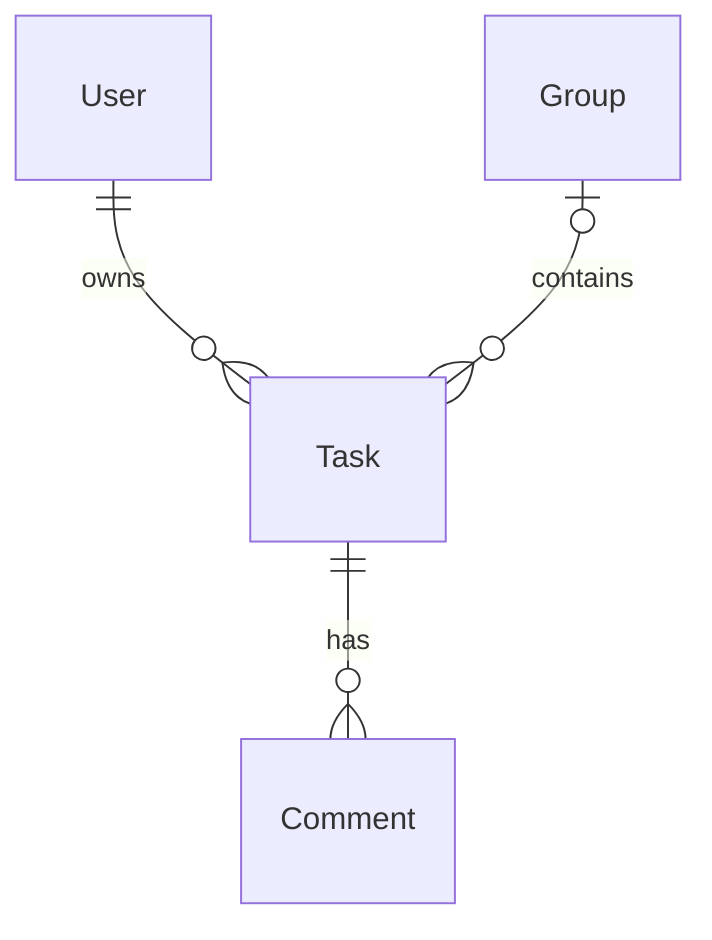

# StudyPrio – Spezifikation der Aufgabenverwaltung

Stand: 24.09.2026. Beitragspaket für Amin Ghazouani (`amin200410`).
Dieses Dokument beschreibt das implementierte Aufgabenmodul, nicht die vollständige
Abnahme von StudyPrio. Bezugscode: `backend/src/modules/tasks/` und
`frontend/src/features/tasks/`. [Architektur](../arch/tasks.md),
[Integration und Prüfung](../tasks-handoff.md).

## P1 – Ziele, Beteiligte und Grenzen

Studierende erfassen Aufgaben, sehen eigene und für sie freigegebene Gruppenaufgaben,
pflegen deren Eigenschaften und kennzeichnen den Fortschritt. Eine Aufgabe kann
erledigt und wieder geöffnet werden. Erledigte Aufgaben bleiben sichtbar und gespeichert.

Amin liefert CRUD, Validierung, Task-Persistenz und Aufgabenoberfläche. Jaouad liefert
Anmeldung/Sitzungen, Haizam Gruppen und Zugriffsrechte, Bassim Priorisierung/Dashboard,
Ahshan Details/Kommentare und den gemeinsamen Start. Das Aufgabenmodul berechnet
keinen Prioritätsscore und implementiert keine eigene Anmeldung oder Gruppenverwaltung.

## P2 – Überblick

React-Oberfläche → eigene Express-API → TaskService mit AccessService → SQLite.
Die Technologie folgt dem vorhandenen Code. Die Firebase-Angabe in TEAMINFO ist
eine überholte Vorplanung; die gemeinsame Aktualisierung liegt beim Team.

## F1 – Ablauf

Nach erfolgreicher Anmeldung lädt die Oberfläche die sichtbaren Aufgaben. Eine neue
Aufgabe gehört persönlich dem angemeldeten Benutzer oder einer ausgewählten Gruppe,
in der er aktuell Mitglied ist. Fachfelder und Status können danach geändert werden;
Eigentümer und Zuordnung bleiben fest. Vor dem Löschen bestätigt der Benutzer die
Entfernung der Aufgabe einschließlich ihrer Kommentare.

## F2 – Anwendungsfälle und Akzeptanz

Die IDs sind modulbezogen und müssen beim Zusammenführen in das Gesamtverzeichnis
eingetragen werden; sie ersetzen keine bereits vergebenen teamweiten UC-Nummern.

| ID | Ablauf | Fehlerfälle und überprüfbares Ergebnis |
|---|---|---|
| TASK-01 Liste lesen | `GET /api/tasks`; optional `?status=open`, `in_progress` oder `done` | Ohne Sitzung 401. Unbekannte/mehrfache Filter 400. Eigene persönliche und aktuell erlaubte Gruppenaufgaben erscheinen; fremde persönliche und unberechtigte Gruppenaufgaben fehlen. Leere Liste ist 200 mit `[]`. |
| TASK-02 Aufgabe lesen | `GET /api/tasks/:id`; auch `getVisibleById(userId,id)` | Unbekannte ID 404; vorhandene, nicht erlaubte Aufgabe 403. Service und HTTP setzen dieselben Regeln durch. |
| TASK-03 Anlegen | Formular absenden, Server validiert und speichert | 201 mit vollständig gespeicherter Task und Location. Titel/Termin/Wichtigkeit/Schwierigkeit/Aufwand sind Pflicht; ungültige Werte 400. Gruppenmitgliedschaft fehlt: 403. `status=open`; Eigentümer/ID/Zeitstempel stammen vom Server. |
| TASK-04 Bearbeiten | Dialog öffnet Fachfelder/Status; `PATCH /api/tasks/:id` sendet nur veränderte Felder | 200 mit gespeichertem Stand. Keine Änderung schließt den Dialog ohne Anfrage. Leeres PATCH, verbotene und unbekannte Felder: 400. Keine Schreibrechte: 403. Nicht vorhandene Aufgabe: 404. Bei Fehler keine Erfolgsmeldung und kein lokales Überschreiben. |
| TASK-05 Löschen | Löschen → Bestätigungsdialog → `DELETE /api/tasks/:id` mit `{}` | Abbrechen erhält Aufgabe. Erfolg 200 mit `{data:{id}}`; Task und zugehörige Kommentare fehlen anschließend in SQLite. 403/404 ändern keine Daten. |

## F3 – Regeln

Persönliche Tasks (`groupId=null`) sind ausschließlich für `ownerId` sichtbar und
änderbar. Gruppen-Tasks benötigen aktuelle Mitgliedschaft; auch ihr ursprünglicher
Ersteller verliert beim Austritt diese Rechte. Alle aktuellen Mitglieder dürfen
bearbeiten/löschen. Die Service-Prüfung wartet die asynchronen AccessService-Aufrufe
ab und erlaubt nur das boolesche Ergebnis `true`. Fehler führen nicht zu einer Freigabe.

Alle drei Statuswerte dürfen ineinander übergehen. Vergangene Deadlines sind erlaubt.
Die Liste zeigt neu erstellte Aufgaben zuerst, bei gleichem `createdAt` sortiert sie
nach ID. Diese technische Reihenfolge ist keine fachliche Priorisierung.

## D1 – Datenmodell

Eine Task hat genau einen Eigentümer und optional eine Gruppe. Nutzer und Gruppen
werden von den zuständigen Modulen verwaltet. `ownerId → users.id` und
`groupId → groups.id` sind Fremdschlüssel. Löschen referenzierter Nutzer/Gruppen ist
zunächst mit `RESTRICT` blockiert; eine abweichende Gruppen-Löschregel muss das Team
abstimmen. Das Modul verschiebt keine Gruppenaufgaben in den persönlichen Bereich.

Ahshans `comments.taskId → tasks.id ON DELETE CASCADE` entfernt Kommentare bei
Task-Löschung. Diese Beziehung gehört zum Kommentarschema und wird nicht doppelt
definiert. Foreign Keys sind in jeder Task-Verbindung aktiv.

Quelle des Diagramms: eigenes Modell; Mermaid-Quelltext ist Bestandteil dieser Datei.

## D2 – Datentypenverzeichnis

| Feld | API-Typ / SQLite | Regel |
|---|---|---|
| `id` | string / TEXT PK | Serverseitige UUID; unveränderlich |
| `title` | string / TEXT | Nach `trim()` 1–120 UTF-16-Codeeinheiten; Pflicht |
| `description` | string / TEXT | Max. 2.000 UTF-16-Codeeinheiten, Standard `''`; Zeilenumbrüche bleiben erhalten |
| `dueAt` | string / TEXT | Gültiger ISO-Zeitpunkt mit `Z` oder `±HH:MM`, normalisiert nach UTC `YYYY-MM-DDTHH:mm:ss.sssZ` |
| `importance` | number / INTEGER | Ganzzahlig 1–5; Pflicht |
| `difficulty` | number / INTEGER | Ganzzahlig 1–5; Pflicht |
| `effortHours` | number / REAL | Endlich, 0,25–200 inklusive; keine Beschränkung auf Viertelstunden; Pflicht |
| `status` | string / TEXT | `open`, `in_progress`, `done`; initial immer `open` |
| `ownerId` | string / TEXT FK | Aus authentifizierter `req.user.id`; nach Erstellung unveränderlich |
| `groupId` | string oder null / TEXT FK | Fehlend/null = persönlich; sonst nicht leere Gruppen-ID; nach Erstellung unveränderlich |
| `createdAt` | string / TEXT | UTC/ISO vom Server; unveränderlich |
| `updatedAt` | string / TEXT | UTC/ISO vom Server bei erfolgreichem PATCH |

`dueAt` akzeptiert Jahre 0001–9999, Stunden 00–23, Minuten/Sekunden 00–59,
optionale Sekunden und 1–3 Nachkommastellen. Das Datum muss im Kalender existieren;
Schaltsekunden, zeitzonenlose Werte und normalisierte UTC-Jahre außerhalb des Bereichs
werden abgewiesen. Browser-Ortszeiten werden in UTC umgerechnet. Nicht existierende
Ortszeiten beim Wechsel zur Sommerzeit sind ungültig. Bei einer doppelt vorkommenden
Herbst-Ortszeit nutzt die neue Eingabe die Auflösung des Browsers; ein unverändert
übernommener Termin behält den ursprünglichen UTC-Wert.

POST erlaubt nur `title,description,dueAt,importance,difficulty,effortHours,groupId`.
PATCH erlaubt nur `title,description,dueAt,importance,difficulty,effortHours,status`.
Unbekannte Felder werden abgewiesen, Zahlenstrings nicht automatisch konvertiert.

## B1 – Oberfläche

Aufgabenliste mit Statusfilter, Neuanlage, Bearbeitungsdialog und Löschbestätigung.
Karten zeigen Titel, Beschreibung, Termin in lokaler Zeit, Aufwand, Wichtigkeit,
Schwierigkeit, Status und Zuordnung. Das Formular bietet passende Feldtypen und
zusätzliches Validierungsfeedback. Der Server prüft unabhängig davon erneut.

Dialoge verwenden natives `<dialog>`, beschriftete Felder, Fokusführung und Escape
(während Speicherung gesperrt). Lade-/Fehlermeldungen und leere Listen sind getrennt.
Buttons werden während Schreibvorgängen deaktiviert. Ein fehlgeschlagener Schreibzugriff
behält die Eingaben; 401/403/404 veranlassen zusätzlich ein Neuladen der Liste.

`TasksWorkspace` lädt aktuelle Gruppen aus Haizams `GET /api/groups` und übergibt
sie als `groups`. „Aktualisieren“ und Neuladen nach Rechtefehlern erneuern auch diese
Auswahl. Gruppenladefehler werden angezeigt; persönliche Aufgaben bleiben nutzbar.
Entfällt die gewählte Gruppe bei offener Neuanlage, bleibt sie als ungültige Option
sichtbar. Der Nutzer muss eine neue Zuordnung ausdrücklich wählen; kein stiller
Wechsel zu persönlich. Nach erfolgreicher Neuanlage wechselt der Statusfilter auf
„Alle Aufgaben“, sodass die neue offene Aufgabe unmittelbar sichtbar ist.
Alternativ können Consumer `TasksPage` direkt mit `groups` aufrufen. Ohne Gruppenliste ist nur
persönliche Neuanlage auswählbar. `onSelectTask(id)` ist der optionale Übergang zu
Ahshans Detailansicht; ohne Callback erscheint kein funktionsloser Detailbutton.
Es gibt keinen Gruppen- oder Anmeldetestadapter im produktiven Frontend-Modul.

## B2 / B3 – Nicht anwendbar

Kein fachlicher Batchlauf und keine Druckausgabe im Aufgabenpaket. Die technische
Schema-Migration ist unter S2 beschrieben.

## S1 – Schnittstellen

Erfolg: `{data: ...}`. Fehler: `{error:{code,message,fields?}}`.
Validation 400; ohne Anmeldung 401; keine Berechtigung 403; unbekannte Task 404;
gelöschte referenzierte Entität 409; Datenbank belegt 503; unerwarteter Fehler 500
über den gemeinsamen Error-Handler ohne interne SQL-Details.

Exportierte Services für Bassim/Ahshan:
`listVisible(userId, {status}={}) → Promise<Task[]>` und
`getVisibleById(userId,taskId) → Promise<Task>` oder `TaskError` mit `status/code/message`.
Die optionalen Statusparameter verändern den vereinbarten Ein-Argument-Aufruf nicht.
Consumer müssen TaskError in ihr HTTP-Fehlerformat übersetzen; der Router des
Consumer-Moduls bekommt Amins Task-Error-Middleware nicht automatisch.

`createTaskApi(api)` unterstützt Jaouads tatsächlich vorhandene Funktion
`api(path,{method,body})` und den im Arbeitsauftrag vorgeschlagenen Methodenclient.
Cookies, Header und Sitzungsprüfung verbleiben bei Jaouad. Sein derzeitiger Client
überträgt Fehlerstatus und Nachricht, aber keine `fields/code`; die Aufgabenoberfläche
hat deshalb eigene Feldhinweise und zeigt serverseitig mindestens die Fehlermeldung.

## S2 – Migration

Auf leerer Datenbank zuerst echte `users`- und `groups`-Migration, dann
`tasks/taskMigration.up(db)`, danach `comments/commentMigration.up(db)`.
Fehlende Fremdtabellen oder deaktivierte FK ergeben eine klare Fehlermeldung.
Wiederholen erhält Daten. Eine Migration bereits abweichender Task-Schemata ist
nicht implementiert; `CREATE TABLE IF NOT EXISTS` ist kein Schema-Upgrade.
Vor Integration vorhandene Kommentare auf verwaiste Task-IDs prüfen; nichts
automatisch löschen. Aufgaben werden nach Neustart aus SQLite geladen.

## S3 – Inbetriebnahme

[Installation mit Start-/Testbefehlen](../tasks-installation.md). Die separate lokale Testansicht
nutzt erfundene Konten und temporäre SQLite-Daten. Sie ist kein Produktivstart.
Das Hauptprojekt braucht noch die gemeinsame Router-/Migrationsmontage.

## N1 / N2 – Qualität und Querschnitt

Keine Freigabe bei ausgefallenen Rechteprüfungen. Parametrisierte SQL-Abfragen;
Texte werden in React als Text gerendert. Löschung und Kommentar-Kaskade sind eine
Datenbankoperation. Schreibvorgänge laufen in SQLite-Transaktionen. Gleichzeitige
Änderungen desselben Feldes folgen dem zuletzt erfolgreich gespeicherten Wert;
keine Versionskonfliktoberfläche. Für kleine Kursdatenmengen erfolgt die Sichtbarkeits-
prüfung pro Task; kein unbelegtes Leistungsversprechen für große Datenbestände.

## E1 / E2 – Lesen und Begriffe

Spec → [Architektur](../arch/tasks.md) → Code → [Prüfung/Übergabe](../tasks-handoff.md).
CRUD = Anlegen/Lesen/Ändern/Löschen. Task = Aufgabe. FK = Fremdschlüssel.
AccessService = Haizams asynchrone Rechteprüfung. UTC = gemeinsame Speicherzeit.

## Eingesetzte KI-Werkzeuge

ChatGPT/Codex am 23.–24.09.2026 für Entwurf, Code, Testfälle und diese Spezifikation.
Prüfung durch tatsächlich ausgeführte automatisierte Tests und Browserprüfung gemäß
[Prüfprotokoll](../tasks-verification.md); keine behauptete menschliche Abnahme.
Amins eigene Prüfung und Erklärung stehen noch aus. Mailhinweise wurden nur aus
dem bereitgestellten Arbeitsauftrag übernommen, nicht anhand Originalmails verifiziert.

## Quellen

- [Verbindliche Kurs-README](https://github.com/carstenlucke/thm_wkb_wk-1106/blob/main/README.md), gelesen 23.09.2026.
- [Bewertung](https://github.com/carstenlucke/thm_wkb_wk-1106/blob/main/BEWERTUNG.md), gelesen 23.09.2026.
- Bereitgestellter Arbeitsauftrag und Code der in der Übergabe genannten Commitstände.
